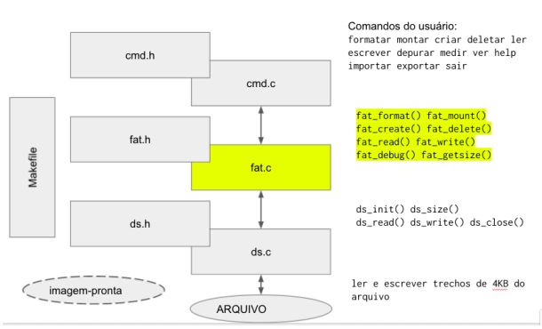

# Projeto-SOII-FAT

  

## Visão Geral

O objetivo do trabalho é desenvolver um sistema de arquivos com base em tabelas de alocação de arquivos (FAT).

Partes da solução são fornecidas já de início. Dessa forma, pode-se concentrar no sistema de arquivos propriamente dito. As outras duas partes são a simulação de disco (que tem um arquivo por baixo) e a interface de comandos.

  

  

## Especificações

- O simulador de disco se apresenta como com N blocos de 4KB (4096 bytes).N costuma valer 20 nos exemplos.

- O primeiro bloco se chama superbloco.

- O segundo bloco é o diretório. Só há 1 diretório, isto é, não é possível criar subdiretórios.

- O terceiro bloco é a FAT. A FAT poderia ocupar mais de um bloco a depender de N.

- Os demais blocos servem para dados.

- O superbloco contém metadados do sistema de arquivos

	- 4 bytes (1 inteiro) que correspondem a um número mágico (0xac0010de)

	- 1 inteiro que contém N (número total de blocos)

	- 1 inteiro que contém o número de blocos da FAT.

- O diretório contém itens, descritos por registros, também chamados de entradas
(como numa matriz, ou numa enciclopédia).
- Cada entrada contém 16 bytes com os seguintes campos:
	- Booleano indicando que a entrada está livre (0) ou ocupada (1)
	- String do nome do arquivo, até 6 bytes, terminada com 0.
	- Um inteiro sem sinal com tamanho do arquivo em bytes.
	- Um inteiro sem sinal indicando o número do primeiro bloco.
- Cada entrada da FAT tem 1 inteiro (4 bytes).
- A FAT tem N entradas.
	- Se o valor da entrada é zero, o bloco está livre.
	- Se o valor da entrada é 1, este é o último bloco do arquivo.

## Operações da FAT
### int fat_format();
Cria um novo sistema de arquivos no disco atual, apagando tudo se for o caso. Cria o superbloco, o diretório e a FAT. Se alguém tentar formatar um sistema de arquivos montado, nada deve ser feito, e um código de erro é devolvido. Devolver 0 indica sucesso e -1, erro.

### void fat_debug();
Exibe informações do disco, assim:
>> superblock:
magic is ok
45 blocks
1 block fat
>> File "bill":
size: 5560 bytes
Blocks: 34 28
>>File "todo":
size: 12330 bytes
Blocks: 12 13 17 

Não importa se está montado ou não.

### int fat_mount();
Verifica se o sistema de arquivos é válido. Se for, traz a FAT e o diretório para a RAM, representadas com registros (structures). As operações abaixo não têm como funcionar se o sistema de arquivos não estiver montado. Devolver 0 indica sucesso e -1, erro.

### int fat_create( char *name );
Cria uma entrada de diretório descrevendo um arquivo vazio. A atualização do diretório acontece na RAM e no disco. Devolver 0 indica sucesso e -1, erro.

### int fat_delete( char *name );
Remove o arquivo, liberando todos os blocos associados com o nome, atualizando a
FAT na RAM e no disco. Em seguida, libera a entrada no diretório. Devolver 0 indica
sucesso e -1, erro.

### int fat_getsize( char *name );
Devolve o número de bytes do arquivo. Em caso de erro, devolve -1.

### int fat_read( char *name, char *buff, int length, int offset );
Lê dados de um arquivo válido. Copia length bytes do arquivo para buff, começando offset bytes a partir do início do arquivo. Devolve o total de bytes lidos. Esse valor pode ser menor que length se chega ao fim do arquivo. Em caso de erro, devolve -1.

### int fat_write( char *name, const char *buff, int length, int offset );
Escreve dados em um arquivo. Copia length bytes de buff para o arquivo, começando de offset bytes a partir do início do arquivo. Em geral, essa operação
envolve a alocação de blocos livres. Devolve o total de bytes escritos. Esse valor pode ser menor que length, por exemplo, se o disco enche. Em caso de erro, devolve -1.

## Operações da simulação de disco (ds)
Estão prontas em ds.h e ds.c. Requerem um arquivo subjacente. Confira ds.h e ds.c.

## Comandos de usuário
Os comandos mapeiam as operações do sistema de arquivos aproximadamente.
"Ver" exibe o conteúdo de um arquivo texto na tela.

## Estruturas de dados
O arquivo fat.c contém sugestões de estruturas de dados para representar na memória o superbloco, o diretório e a FAT. São variáveis globais (sb, dir e fat).

